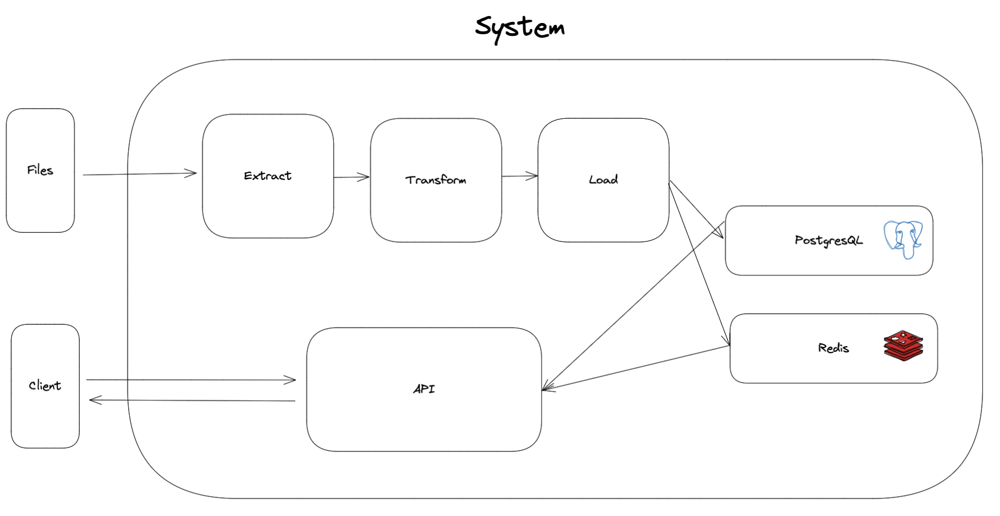

# the-cat

## Assessment write-up:

### Functional and non-functional requirements:

### Functional requirements:
- Extract data from CSV files and load into SQL and NoSQL databases
- Data in databases must be exposed via an API
- API must serve data in both JSON and CSV formats for both NoSQL and SQL databases
- API must serve the reservation dataset enriched with location titles

### Non-functional requirements:
- Data must be cleaned from raw format before stored in databases
- Data must be properly modelled in databases
- API must be serve data within reasonable time
- API response must be correct and consistent
- API must serve data in correct format

### Process:

1. Data is extracted from the files
2. Data is cleaned and transformed
3. Data is loaded into PostgreSQL and Redis databases
4. API extracts data from databases and serves it to the client in appropriate format

### Points for improvement:

#### ETL
- Calculate city null values through the provided coordinates

### Databases:
- Improve format of data storage for Redis
- Improve efficiency of data extraction Redis
- Use ORM for both SQL and NoSQL
- Data modelling: add foreign key constraint for location_id

#### API
- Improve formatting: automatic float conversion on int types when reading from database.
- Improve formatting: add "id" value on JSON export
- Improve performance: loadbalancing server, asynchronous calls with FastAPI and caching layer
- Refactor code

